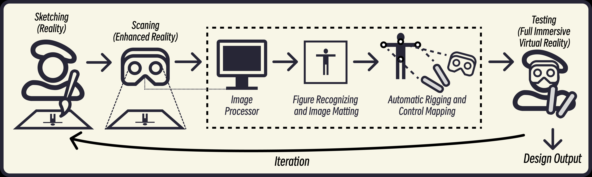

# ShadowRehearsal-Workflow

This is a project attempts to integrate XR technology into traditional art design workflow. Having Selected Shadow Puppetry as a entry point, I developed and tested a system called "ShadowRehearsal" among practitioners, demonstrating that XR technology can revolutionize traditional art workflows by significantly enhancing rapid prototyping and testing of design concepts.

     
    
     

    Figure 1: Demonstration of ShadowRehearsal.👆 

## Pain points in Shadow Play Design Workflow

 We observed the design workflow of this cultural theme and conducted interviews with designers. During the creation process, artists often need to produce multiple puppets based on the same artistic design for stage effect testing and action choreography. The complexity of the production process and the fragility of the puppets significantly increase creative costs, reducing the artists' inclination to explore new stage effects and narratives.

## System Design: ShadowRehearsal

 Go through: After completing puppet figures designs on paper, the designer uses the HMD's camera to [capture](https://github.com/CidsHo/CaptureScreen) the sketch within the user's field of view in an augmented reality environment. The image is then sent to the image processor, which uses OpenCV for basic sharpening and matting, followed by animation rigging and control mapping. The processed image is applied to an interactive virtual stage with a puppet control simulation system allowing the designer to choreograph shadow puppet's movements and preview stage effects.

     
    
     

    Figure 2: (a) Image capture: user aims the headset at the sketch, and a preview image is displayed after recording; (b) Image processing: joints are bound and marked with green dots; (c) Manipulation simulation demonstration from the user's perspective.

**To be published in late Oct. 2024. **
